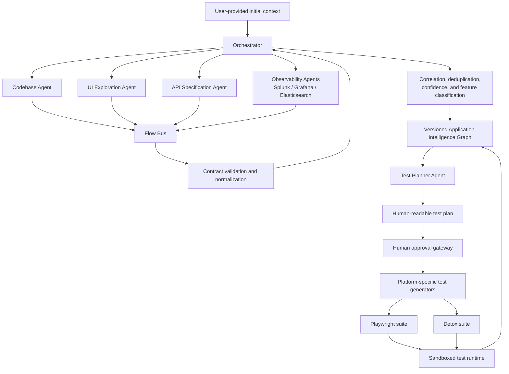
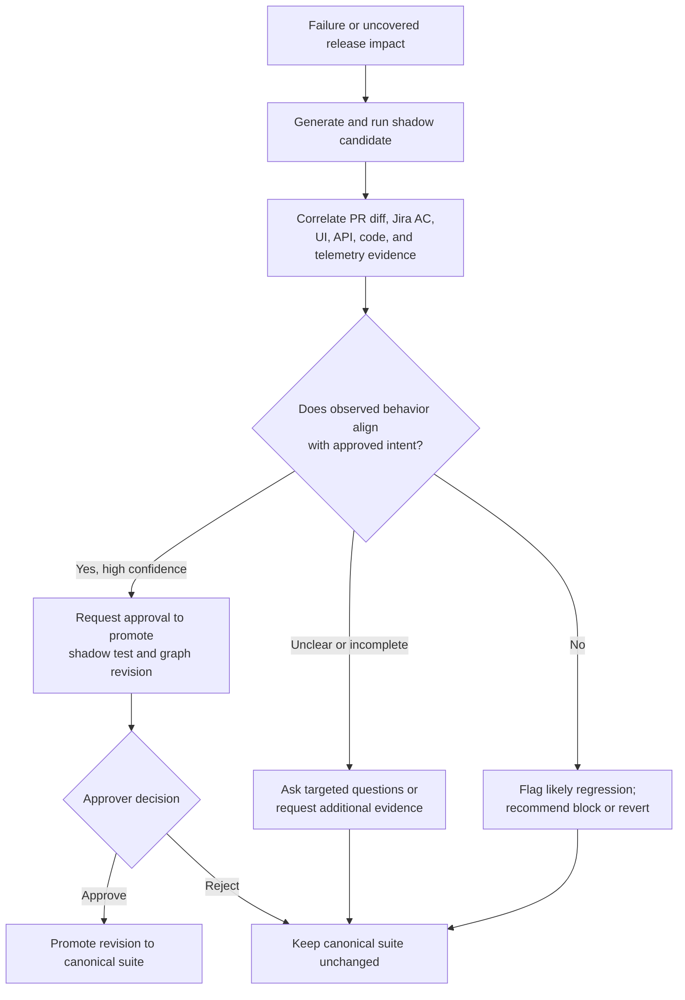

# Agentic Testing Intelligence Framework

> **Document type:** Product and architecture narrative  
> **Status:** Concept / Draft  
> **Audience:** Engineering, Quality, Product, Platform, Security, and Release Management  
> **Working title:** Agentic Testing Intelligence Framework (ATIF)  
> **Primary outcome:** Continuously discover, generate, validate, and safely maintain application test suites using AI agents, MCP servers, LLMs, and human approval.

---

## 1. Executive Summary

Modern regression suites gradually lose contact with the applications they are meant to protect. Product behavior changes, selectors drift, APIs evolve, and acceptance criteria live separately from executable tests. Teams respond by manually repairing failed tests, often without enough evidence to distinguish an intended product change from a defect.

The **Agentic Testing Intelligence Framework** treats testing as a continuously evolving understanding of the application rather than a static collection of scripts.

On its first run, the framework deploys a fleet of specialized agents to inspect the codebase, explore the user interface, understand API specifications, and collect runtime evidence from observability platforms such as Splunk, Grafana, or Elasticsearch. These agents work in parallel and publish evidence through a common contract. An orchestrator correlates and deduplicates their observations, assigns confidence scores, identifies end-to-end flows, groups those flows into features, and builds a versioned **Application Intelligence Graph**.

The graph becomes the foundation for a human-readable test plan. After human approval, platform-aware test generators convert the plan into executable suites—for example, Playwright for web applications and Detox for mobile applications.

For every staging release, the framework combines regression results with pull-request diffs, linked Jira acceptance criteria, API changes, and runtime evidence. When a test fails, it creates a temporary **shadow test** rather than immediately modifying the canonical suite. It then determines whether the drift is an intended change, an ambiguous change, or a likely regression. Only approved, evidence-backed changes are promoted into the regression suite.

The result is a governed system that can answer three important questions:

1. **What does the application currently do?**
2. **What should be tested, and with what confidence?**
3. **When behavior changes, is it intentional—and should the test suite change with it?**

---

## 2. The Story

Imagine a team preparing a staging release for a frequently changing web and mobile product.

Today, a failed test gives the team only a symptom: a button was not found, a response changed, or a journey stopped halfway. The failure does not explain whether the product is broken, the test is stale, or the requirement has changed. An engineer must inspect the pull request, search Jira, compare screenshots, review logs, and decide what to trust.

With this framework, the application has a living intelligence model.

Before the release, the framework already understands that “Manage payment method” is a feature composed of a login flow, a customer lookup API, a payment UI, and several observable backend events. It knows which evidence produced that understanding, how recent the evidence is, and where confidence is weak.

When the staging test fails because “Update card” has become “Replace payment method,” the framework does not blindly repair the selector. It creates a shadow version of the affected test, reads the release diff, locates the linked Jira acceptance criteria, compares the new UI and API behavior, and checks the expected backend events. It then presents an approver with an evidence package:

- the old behavior and the observed behavior;
- the relevant source-code and API changes;
- the acceptance criteria supporting—or contradicting—the change;
- the proposed test update;
- the confidence score and unresolved risks.

If the evidence proves the change is intentional, the approver can promote the shadow test. If the evidence is incomplete, the framework asks a focused question. If the implementation conflicts with the acceptance criteria, it recommends blocking or reverting the staging change and explains how the product or test may need to be corrected.

The suite therefore evolves with the product, but never silently.

---

## 3. Goals and Non-Goals

### Goals

- Discover application features and flows from multiple independent evidence sources.
- Produce a versioned, explainable model of application behavior.
- Generate human-readable test plans before generating executable code.
- Support web and mobile test generation through platform-specific adapters.
- Use release changes and Jira acceptance criteria to explain test drift.
- Propose safe self-healing through shadow tests and human approval.
- Preserve provenance, confidence, and audit history for every automated decision.
- Identify missing coverage, including new or changed flows that do not cause an existing test to fail.

### Non-Goals

- Replacing unit, component, security, performance, or accessibility testing.
- Allowing an LLM to change production code or canonical tests without policy checks.
- Treating a UI observation as proof of intended product behavior.
- Automatically approving a release solely because generated tests pass.
- Using production customer data during autonomous exploration.

---

## 4. Guiding Principles

1. **Evidence before inference** — LLM conclusions must be grounded in identifiable source evidence.
2. **Parallel discovery, centralized correlation** — Specialized agents gather evidence independently; the orchestrator resolves the combined picture.
3. **Contracts over agent-specific payloads** — Every agent emits a shared envelope with typed payloads and provenance.
4. **Confidence is layered** — Code, UI, API, and telemetry confidence are calculated separately before correlation.
5. **Plans before code** — Humans approve intent in natural language before the system generates test implementation.
6. **Shadow before healing** — Proposed repairs run beside the canonical suite before they can replace it.
7. **No silent mutation** — Material changes are versioned, reviewable, reversible, and attributable.
8. **The graph is the system of understanding; tests are generated views** — A test suite is one output of application intelligence, not the only source of truth.

---

## 5. Conceptual Architecture



### Core components

| Component | Responsibility |
|---|---|
| Orchestrator | Starts runs, dispatches agents, enforces policies, correlates evidence, makes bounded decisions, and manages HITL checkpoints. |
| Agent fleet | Performs specialized discovery or reasoning with the minimum permissions required for its domain. |
| MCP layer | Provides standardized access to code repositories, browsers/devices, Jira, observability systems, API catalogs, and test infrastructure. |
| Flow Bus | Carries immutable agent events and supports replay, fan-out, ordering, and failure recovery. |
| Contract Registry | Validates event envelopes and versioned, agent-specific payload schemas. |
| Correlation Engine | Resolves identities, deduplicates observations, detects contradictions, constructs flows, and calculates confidence. |
| Application Intelligence Graph | Stores versioned features, flows, steps, dependencies, evidence, test coverage, release changes, and confidence. |
| Test Planner | Converts graph knowledge and risk policy into a natural-language test plan. |
| Approval Gateway | Captures decisions, comments, scope restrictions, and signatures from authorized reviewers. |
| Test Generators | Compile approved plans into platform-specific test suites. |
| Shadow Suite Manager | Isolates proposed test changes, executes them, compares outcomes, and promotes only approved revisions. |

---

## 6. First-Run Application Discovery

The first run establishes the baseline understanding of an application.

### 6.1 Initial context

The user supplies a minimum bootstrap package, such as:

- application name and environment;
- repository and default branch;
- web URL, mobile build, or both;
- authentication method and sandbox test identities;
- known business-critical journeys;
- API specification locations;
- observability sources and query boundaries;
- execution constraints, excluded areas, and risk policies.

The initial context is an input hypothesis, not unquestioned truth. Every downstream assertion must retain its evidence and confidence.

### 6.2 Parallel evidence acquisition

The orchestrator creates a discovery run and dispatches independent work in parallel.

#### Codebase Agent

The Codebase Agent fetches an authorized snapshot and builds an application index containing:

- modules, routes, screens, components, services, and domain entities;
- API clients, endpoints, events, feature flags, and permission checks;
- test identifiers and existing tests;
- likely user journeys inferred from routing and call relationships;
- source locations and commit identifiers for every observation.

Its output is an index and dependency map—not a claim that every reachable code path is active.

#### UI Exploration Agent

The UI Agent uses a mocked user in a sandboxed browser or device environment to:

- navigate reachable screens;
- perform allowed user actions;
- capture semantic UI structure, screenshots, and network activity;
- identify alternate states, validation behavior, and recovery paths;
- publish replayable flow observations to the Flow Bus.

Exploration budgets, destructive-action policies, test data, and domain allowlists limit its autonomy.

#### API Specification Agent

The API Agent analyzes OpenAPI, GraphQL, protobuf, or other available contracts to identify:

- operations, parameters, schemas, errors, and authentication requirements;
- deprecations and version boundaries;
- links between UI activity and API operations;
- contract gaps between documentation and observed traffic.

#### Observability Agents

Splunk, Grafana, and Elasticsearch agents query approved environments and time windows to identify:

- service calls and backend events generated by discovered flows;
- latency, errors, retries, and state transitions;
- correlation or trace identifiers;
- contradictions between expected and actual runtime behavior.

These agents should default to read-only access and redact secrets and personal data before emitting evidence.

### 6.3 Correlation and flow construction

The orchestrator consumes normalized events and correlates them using stable and probabilistic identifiers, including:

- route and screen identity;
- API operation IDs and normalized paths;
- source symbols and service names;
- trace, session, request, and correlation IDs;
- semantic action and entity names;
- timestamps within a bounded execution window.

Duplicate observations are merged while preserving all provenance. Contradictions remain visible and reduce confidence rather than being discarded.

### 6.4 Feature classification

Correlated steps are assembled into candidate flows. An LLM may cluster related flows and propose human-readable feature names, but names are treated as editable metadata. Stable graph IDs must not depend on generated labels.

For example:

```text
Feature: Payment Method Management
├── View saved payment methods
├── Add a payment method
├── Replace an expired payment method
└── Handle payment validation failure
```

### 6.5 Graph creation

The resulting Application Intelligence Graph is versioned against the exact evidence set used to build it: repository commit, application build, environment, API-spec version, exploration run, and observation window.

### 6.6 Plan, approval, and generation

The Test Planner creates a natural-language plan containing:

- objective and business risk;
- prerequisites and test data;
- user persona and permissions;
- steps and expected results;
- UI, API, and telemetry assertions;
- platforms and viewport/device coverage;
- confidence, evidence links, and known gaps;
- priority and recommended execution frequency.

Approvers may accept, reject, edit, or constrain the plan. Only approved items are compiled into Playwright, Detox, or future platform adapters. Generated tests are then executed in the sandbox to establish a passing baseline before entering the regression suite.

---

## 7. Agent Output Contract

Every agent publishes the same envelope and a typed payload. This allows the orchestrator to understand the event without being coupled to the emitting agent’s implementation.

```json
{
  "contract_version": "1.0",
  "event_id": "evt_01J...",
  "event_type": "flow.observation.created",
  "run_id": "run_01J...",
  "application_id": "app_checkout",
  "emitter": {
    "agent_id": "ui-agent-07",
    "agent_type": "ui_explorer",
    "agent_version": "2.3.1",
    "model": "configured-model-id",
    "toolchain": ["browser-mcp@1.4"]
  },
  "context": {
    "environment": "sandbox",
    "platform": "web",
    "source_revision": "git-sha",
    "started_at": "2026-06-30T10:00:00Z"
  },
  "subject": {
    "type": "flow_step",
    "candidate_id": "candidate:add-payment-method:step-4"
  },
  "payload": {
    "action": "submit payment method",
    "observed_result": "payment method saved",
    "related_api_operations": ["POST /payment-methods"]
  },
  "evidence": [
    {
      "type": "screenshot",
      "uri": "artifact://runs/run_01J/screens/step-4.png",
      "sha256": "...",
      "redaction_status": "verified"
    }
  ],
  "confidence": {
    "score": 0.89,
    "method": "ui-observation-v2",
    "factors": {
      "direct_observation": 1.0,
      "repeatability": 0.8,
      "freshness": 1.0
    }
  },
  "permissions_used": ["browser.navigate", "browser.interact"],
  "trace": {
    "parent_event_id": "evt_01H...",
    "correlation_ids": ["trace-abc", "session-123"]
  },
  "created_at": "2026-06-30T10:02:31Z"
}
```

### Contract requirements

- **Versioned:** Schemas evolve through explicit compatibility rules.
- **Immutable:** Corrections are new events linked to superseded events.
- **Attributable:** Agent, model, tools, prompt/policy version, and source revision are recorded.
- **Evidence-backed:** Assertions link to tamper-evident artifacts or source references.
- **Confidence-aware:** Agent confidence is included but recalculated by the orchestrator.
- **Permission-aware:** The event records which capabilities were exercised.
- **Replayable:** The Flow Bus can reconstruct a run without calling the agent again.

---

## 8. Confidence Model

Confidence must communicate the strength of evidence, not how persuasive an LLM sounds.

Each flow receives separate layer scores:

- **Code confidence:** Structural support in the current source revision.
- **UI confidence:** Directly observed and repeatable user behavior.
- **API confidence:** Alignment between specification, observed traffic, and responses.
- **Telemetry confidence:** Runtime confirmation through logs, metrics, events, or traces.
- **Requirement confidence:** Alignment with approved acceptance criteria or product rules.
- **Test confidence:** Stability and repeatability of the generated or existing test.

An illustrative configurable formula for layer `l` and flow `f` is:

```text
C_layer(f, l) = reliability(l) ×
                [0.30 × evidence_strength
               + 0.25 × coverage
               + 0.20 × consistency
               + 0.15 × repeatability
               + 0.10 × freshness]
```

The orchestrator may combine independent supporting layers as:

```text
C_combined(f) = [1 − ∏(1 − C_layer(f, l))] × (1 − contradiction_penalty)
```

The exact formula and thresholds must be policy-driven, calibrated against historical decisions, and versioned. Missing evidence must never be treated as negative evidence, and correlated sources must not be counted as independent proof.

Suggested interpretation:

| Score | Meaning | Default action |
|---:|---|---|
| 0.85–1.00 | Strong, corroborated evidence | Eligible for approval workflow |
| 0.65–0.84 | Useful but incomplete evidence | Request targeted review or additional execution |
| 0.40–0.64 | Ambiguous or conflicting evidence | Do not mutate canonical tests |
| Below 0.40 | Weak or stale evidence | Re-discover or escalate |

The UI should always display the contributing factors and contradictions beside the aggregate score.

---

## 9. Application Intelligence Graph

The graph is the persistent, versioned representation of what the framework knows.

### Principal node types

- Application, release, build, environment, and source revision
- Feature, flow, step, state, and user persona
- UI screen, component, and semantic element
- API operation, schema, service, event, and data entity
- Source module, symbol, route, and feature flag
- Requirement, Jira issue, acceptance criterion, and pull request
- Test plan, test case, test implementation, and execution result
- Evidence artifact, agent observation, confidence assessment, and approval

### Principal relationships

```text
FEATURE CONTAINS FLOW
FLOW HAS_STEP STEP
STEP INTERACTS_WITH UI_ELEMENT
STEP CALLS API_OPERATION
API_OPERATION HANDLED_BY SOURCE_SYMBOL
FLOW EMITS TELEMETRY_EVENT
TEST_CASE COVERS FLOW
PR IMPLEMENTS JIRA_ISSUE
AC DEFINES_EXPECTATION FLOW
RELEASE INCLUDES PR
OBSERVATION SUPPORTS | CONTRADICTS CLAIM
APPROVAL AUTHORIZES TEST_REVISION
```

### Versioning rules

- Each graph snapshot is immutable and addressable.
- Changes are stored as a diff from the previous accepted snapshot.
- Generated names can change without changing stable entity IDs.
- Evidence, confidence formula version, and approval history remain attached.
- Release-time decisions reference both the before and after graph snapshots.

---

## 10. Test Planning and Generation

### Natural-language plan example

```text
Test: Replace an expired payment method
Risk: High — affects a customer’s ability to complete payment
Platforms: Web and iOS
Persona: Authenticated customer with one expired saved card

Given the customer is signed in
And an expired payment method exists
When the customer opens Payment Methods
And replaces the expired card with valid card details
Then the new payment method is displayed as active
And the expired method is no longer selectable
And POST /payment-methods returns the documented success contract
And the payment_method.updated event is observable for the same trace

Evidence confidence: 0.88
Known gap: Android UI has not yet been directly observed
```

### Generation pipeline

1. Validate that the plan is approved and its evidence is still current.
2. Select the platform generator and project conventions.
3. Reuse shared fixtures, page/screen objects, test data builders, and semantic locators.
4. Generate assertions across the layers required by the plan.
5. Run linting, type checks, and framework validation.
6. Execute repeatedly in the sandbox to estimate stability.
7. Produce a code diff, evidence bundle, and traceability links.
8. Admit the test to the canonical suite only when quality gates pass.

Generated tests should prefer stable semantic interfaces—roles, labels, test IDs, API operation IDs, and event schemas—over brittle coordinates, text fragments, or implementation details.

---

## 11. Staging Release Intelligence and Safe Self-Healing

### 11.1 Release input

When a staging release is planned, the release is assigned a unique tag. The framework builds a change set by comparing it with the previous accepted release and collecting:

- included pull requests and source diffs;
- linked Jira issues and acceptance criteria;
- changed routes, components, APIs, schemas, flags, and services;
- impacted graph nodes and existing tests;
- deployment metadata and environment configuration.

Acceptance criteria are first-class release evidence. A pull request without an accessible requirement link or sufficient acceptance criteria reduces requirement confidence and may require additional approval.

### 11.2 Regression and impact analysis

The canonical suite runs against staging. In parallel, the framework performs graph-based impact analysis.

This second step is essential: a release may introduce a new flow or remove coverage without causing any existing test to fail. The system must therefore report both:

- **failing existing tests**, and
- **changed behaviors with no adequate test coverage**.

### 11.3 Shadow test creation

For a failed or newly impacted flow, the framework keeps the canonical test unchanged and creates an isolated shadow candidate using:

- the previous test intent and implementation;
- PR and API diffs;
- Jira acceptance criteria;
- the newly observed UI flow;
- current logs, metrics, events, and traces;
- the before and after graph snapshots.

The shadow suite is executed independently and cannot affect the release gate until evaluated.

### 11.4 Drift classification



### 11.5 Decision matrix

| Observed result | PR/Jira alignment | Confidence | Framework action |
|---|---|---:|---|
| Existing test fails; shadow test passes | Strongly aligned with acceptance criteria | High | Request approval to promote the shadow test. |
| Existing and shadow tests fail | Implementation contradicts intended behavior | High | Recommend release block or revert; identify likely product fix. |
| Existing test fails; requirement is incomplete | Ambiguous | Medium/low | Ask the approver focused questions; do not self-heal. |
| Existing test passes; changed flow is untested | Change is intended | High | Propose a new test and coverage update. |
| UI changed but API and telemetry do not match the requirement | Contradictory | Any | Flag cross-layer drift and recommend investigation. |
| Shadow test is flaky | Any | Low test confidence | Quarantine the candidate and diagnose instability. |

### 11.6 Drift-fix suggestions

Every drift report should explain the likely correction by layer:

- **Product implementation:** component, route, service, schema, or flag likely causing unintended behavior.
- **Test implementation:** selector, fixture, timing, mock, expected value, or test-data assumption that is stale.
- **Requirement:** acceptance criterion that is missing, ambiguous, or inconsistent with the implementation.
- **Environment:** configuration, deployment, dependency, identity, or data issue specific to staging.
- **Observability:** missing correlation IDs, logs, metrics, or events needed to verify the outcome.

Suggestions are advisory unless a separately authorized workflow permits code changes.

---

## 12. Human-in-the-Loop Governance

The framework uses risk-based approval gates.

### Mandatory approval points

- Initial natural-language test plan
- Addition of generated tests to the canonical suite
- Promotion of a shadow test as a self-healed replacement
- Material change to a critical flow or expected business outcome
- Release-block or revert recommendation
- Expansion of an agent’s permissions or environment scope

### Approval package

An approver should receive:

- a concise decision request;
- before/after behavior and graph diff;
- linked PRs, Jira issues, and acceptance criteria;
- evidence from every available layer;
- confidence factors and contradictions;
- proposed test or product change;
- blast radius, alternatives, and rollback path;
- expiry time if the evidence may become stale.

Approval policy can vary by risk. Low-risk selector-only changes may require one reviewer; changes to payment, identity, privacy, or destructive actions may require multiple authorized reviewers.

---

## 13. Safety, Security, and Reliability

### Agent and MCP security

- Grant least-privilege, short-lived credentials to each agent.
- Separate read, execute, and write capabilities at the tool level.
- Restrict browser and device activity to allowlisted sandbox environments.
- Prevent access to production customer data by default.
- Treat repository content, web content, logs, and Jira text as untrusted input to defend against prompt injection.
- Validate tool arguments and outputs outside the LLM.
- Redact credentials, tokens, personal data, and sensitive payloads before storage.
- Record tool calls, policy decisions, model versions, and artifact hashes in an audit log.

### Reliability controls

- Use idempotent run and event identifiers.
- Support retries, timeouts, cancellation, dead-letter queues, and event replay.
- Isolate failures so one agent does not invalidate the entire discovery run.
- Pin model, prompt, contract, policy, and generator versions for reproducibility.
- Detect flaky tests through repeated and statistically meaningful execution.
- Expire stale evidence and require revalidation after significant changes.
- Keep canonical tests protected through normal source-control review and branch policies.

---

## 14. Key Success Measures

| Measure | Desired direction |
|---|---|
| Critical-flow coverage | Increase |
| Requirement-to-test traceability | Increase |
| Mean time to explain a failed regression | Decrease |
| Mean time to repair an approved stale test | Decrease |
| False self-heal proposal rate | Decrease |
| Escaped regressions in mapped flows | Decrease |
| Flaky-test rate | Decrease |
| Percentage of decisions with complete provenance | Approach 100% |
| Human approval turnaround time | Decrease without reducing safety |
| Graph freshness at release time | Increase |

The framework should initially optimize for **decision precision and explainability**, not maximum autonomy.

---

## 15. Suggested Delivery Roadmap

### Phase 1 — Evidence and planning foundation

- Define the common event contract and Flow Bus.
- Integrate one repository, one web sandbox, and one API-spec source.
- Build Codebase, UI, and API agents.
- Create the first Application Intelligence Graph schema.
- Produce natural-language plans with human approval.
- Generate Playwright tests for a small set of critical flows.

### Phase 2 — Runtime correlation

- Add one observability integration and trace correlation.
- Introduce layer-specific confidence scoring and contradiction handling.
- Add provenance UI and graph version diffs.
- Measure test stability and evidence freshness.

### Phase 3 — Release intelligence

- Ingest release tags, PR diffs, Jira links, and acceptance criteria.
- Add graph-based impact analysis.
- Create shadow suites and drift classifications.
- Generate approval packages and drift-fix suggestions.

### Phase 4 — Governed self-healing and mobile

- Promote approved shadow changes through source-control workflows.
- Add Detox and mobile sandbox support.
- Introduce risk-tiered approval policies.
- Calibrate confidence thresholds using historical reviewer outcomes.

### Phase 5 — Scale and ecosystem

- Add more test frameworks, repositories, observability providers, and requirement systems.
- Support multi-application and cross-service journeys.
- Add policy-as-code, tenancy boundaries, cost controls, and enterprise audit exports.

---

## 16. MVP Boundary

A credible MVP should stay deliberately narrow:

- one web application;
- Playwright only;
- one repository and default branch;
- OpenAPI as the API contract;
- one observability provider;
- Jira issues with structured acceptance criteria;
- three to five high-value user journeys;
- natural-language plan approval;
- shadow-test proposals without automatic promotion;
- graph snapshots and complete evidence provenance.

This boundary proves the hardest part of the idea: whether multiple agents can form a trustworthy, explainable model of a flow and use release evidence to distinguish intended test drift from a product regression.

---

## 17. Open Decisions

1. What graph store and event store best satisfy versioning, scale, and audit needs?
2. Which source owns feature identity when LLM-generated names change?
3. What is the minimum acceptance-criteria quality required for release decisions?
4. Which actions may agents perform without approval in each environment?
5. How long should evidence remain valid for each layer?
6. How are contradictory signals resolved when UI behavior, APIs, and telemetry disagree?
7. What confidence thresholds apply to each risk class?
8. How are test data and identities provisioned and safely reset?
9. How will the system measure and limit LLM and agent execution cost?
10. Should approved graph changes be stored only in the graph, or also serialized into source control?

---

## 18. Proposed One-Line Vision

> **A living, evidence-backed testing system that understands application behavior, turns that understanding into approved executable tests, and safely evolves those tests as the product changes.**

